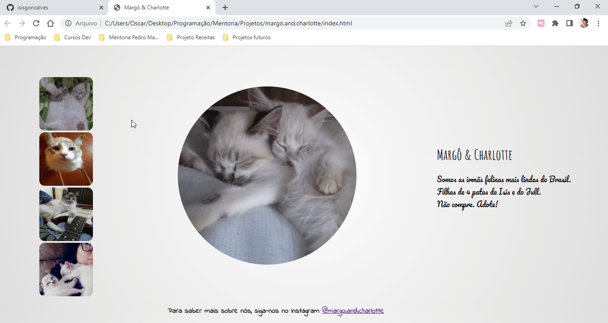

# Margô & Charlotte

## Desafio

Criar uma página dedicada as minhas filhas de 4 patas.

## Tecnologias aplicadas

* HTML
* CSS

## Conceitos aplicados

* Conceito display-flex.
* Customização de fonte com Google Fonts.
* Aplicação de imagens em grid.
* Customização de borda, com border-radius.
* Customização de background com gradiente de cores.
* Aplicação de Link para o perfil do Instagram.
* Aplicação de efeito :hover ao clicar nas imagens.

## Autores

- [@isisgoncalves](https://www.github.com/isisgoncalves)

## 🚀 Sobre mim
Sou desenvolvedora front-end. 
Atualmente trabalho com HTML e CSS, sendo JS meu próximo tópico de estudo.

## Demonstração

 

## :open_file_folder: O que acha de acessar o projeto? 
Você pode acessar o projeto clicando [aqui](https://isisgoncalves.github.io/margo.and.charlotte/).
